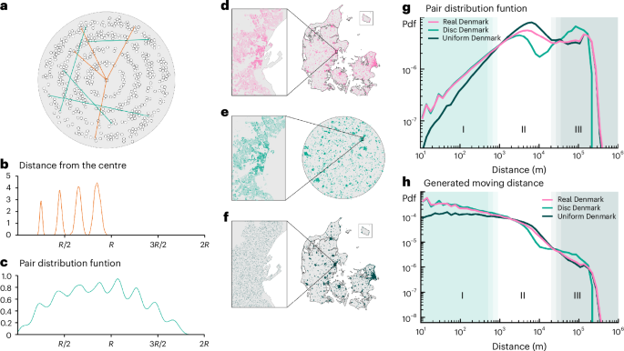
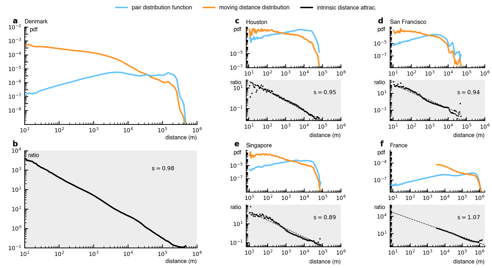

# Decoupling geographical constraints from human mobility

*Sep 8, 2025 · By Louis Boucherie and Sune Lehmann*

> By explicitly accounting for geography using the "pair distribution function", we found a universal power law governing human mobility.

In our new paper published in [Nature Human Behavior](https://www.nature.com/articles/s41562-025-02282-7), "Decoupling geographical constraints from human mobility", we explore how geography shapes how humans move. Using new, uniquely precise residential mobility data from Denmark, we found surprising insights. We examined how mobility patterns are influenced by the shape of landmasses, lakes, rivers, and the placement of buildings, roadways, and cities.

Our investigation began with a unique dataset, 40 years of residential relocations for every single person in an entire nation — the country of Denmark. In total, our dataset covers 39 million moves, each located with a precision of two meters. Human movement data typically shows power law patterns, where travel likelihood decreases predictably with distance. However, our Danish data initially looked completely different from the usual power law behavior (the orange line in figure 1a). We observed distinct spikes around 180 kilometers, precisely matching distances between major Danish cities, such as Copenhagen-Aarhus (188 km), Copenhagen-Odense (164.11 km), and Odense-Aalborg (185.98 km). These anomalies immediately indicated some of the ways that geography influences mobility patterns.

*Figure 1. Mobility data from Denmark and the pair distribution reveal a universal power law across five orders of magnitude.*

## A Very Straight Line

Specifically, we realized that not all residential moves are possible. One can generally only move between places where a house is actually present (or can be built). There are many areas of space that are simply not accessible for moves. Inspired by techniques from epidemiology, we calculated the pairwise distances between all addresses in Denmark (the blue line in figure 1a). We did this because these pairwise distances precisely capture that moves that are indeed possible to make. This led to a striking finding: Normalizing mobility data by this pairwise geographic distribution suddenly revealed an astonishingly clear result: a perfect power law spanning five orders of magnitude — from 10 meters up to 1,000 kilometers (figure 1b). This remarkable finding held true when we tested additional datasets from residential mobility in France (figure 1f) and even daily movements within major cities like Houston (figure 1c), Singapore (figure 1e), and San Francisco (figure 1d).

## Just the Gravity Law?

If you are familiar with human mobility you might recognize this pattern as reminiscent of the classic "gravity law", which suggests that the flow between locations decreases proportionally with distance and increases with population size. For example, Chicago and Indianapolis are both 450 km from Detroit, but we would expect far more migration between Detroit and Chicago (a major metropolitan area) than between Detroit and Indianapolis (a much smaller city). Similarly, Dallas would likely exchange more migrants with nearby Houston than with Atlanta, even though Houston and Atlanta are similar-sized cities, because Houston is only 385 km away while Atlanta is over 1,250 km from Dallas.

We find that our discovery does indeed align closely with the gravity model but goes further by generalizing it into a continuous, geography-independent form (figure 2a). Traditional gravity laws are discrete, depending on population size defined by administrative boundaries. As we discussed above, our approach uses the concept of the "pair distribution", to measure the distribution of distances between every pair of addresses. A neat take on our result is that the pair distribution allows us to take the idea of a population within some area to the continuous limit. When two cities are far apart, the pair distribution becomes concentrated (like a sharp spike) at their separating distance, effectively mirroring the gravity model's "mass-product" (population product) term but at the much finer scale of individual addresses (figure 2b).

*Figure 2. From the universal power law to a continuous gravity model and the piecewise behavior at city scale.*

## Actually, There Is More to It...

However, the story does not end here. When considering mobility centered around a single city — rather than mobility of an entire country — a more nuanced picture emerges. Instead of a simple global power law, we observed a universal piecewise behavior (figure 2d). Mobility within a city is governed by one power law (which tells us that distance matters less), while another, steeper power law describes moves between cities. The second power law reflects the stronger deterrent of greater distances. This local pattern is universal in the sense that it appeared consistently across more than a thousand Danish towns, highlighting distinct internal dynamics at different spatial scales (figure 2e).

## Summary and Next Steps

By explicitly accounting for geography using the "pair distribution", we found a universal power law governing human mobility, a pattern consistent across datasets including residential moves in Denmark and France, and daily movements in cities like Houston, Singapore, and San Francisco. Additionally, at city scale, we observed a universal piecewise behavior: one power law for within-city mobility and a steeper one for between-city movements, reflecting a varying impact of distance.

The pair-distribution methodology opens up new avenues for exploration. We plan to look into commuting patterns, applying our approach to understand daily movements between home and work. Additionally, we aim to investigate how the observed power law patterns might vary across different demographic groups. Furthermore, our work highlights the critical role of geography and the spatial distribution of settlements in shaping mobility, and we intend to explore this relationship in more detail in future research.

---

[paper](https://www.nature.com/articles/s41562-025-02282-7) · [original springer post](https://communities.springernature.com/posts/decoupling-geographical-constraints-from-human-mobility)
